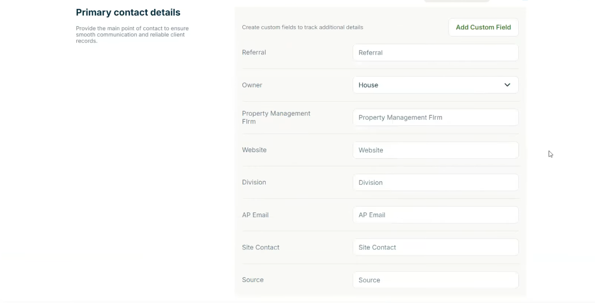
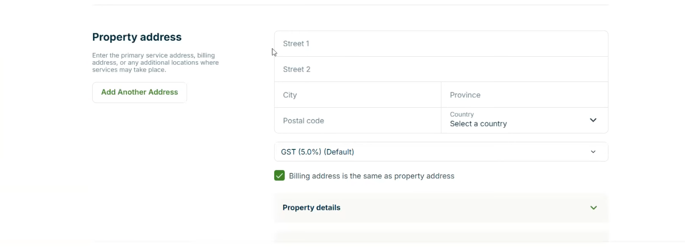
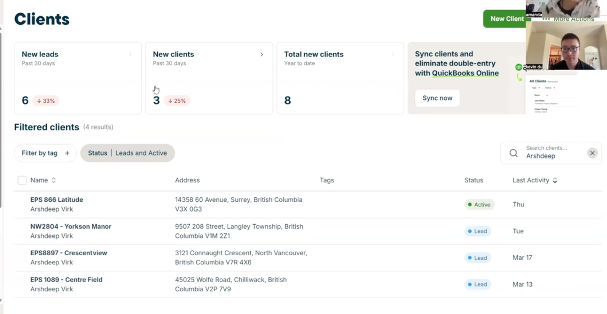
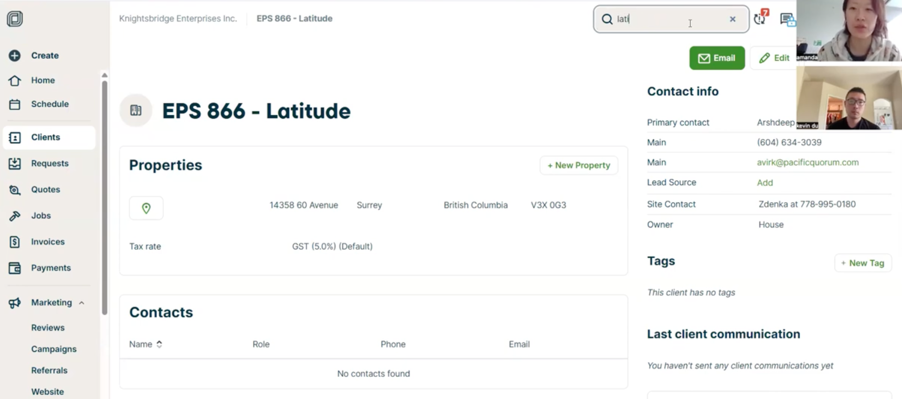
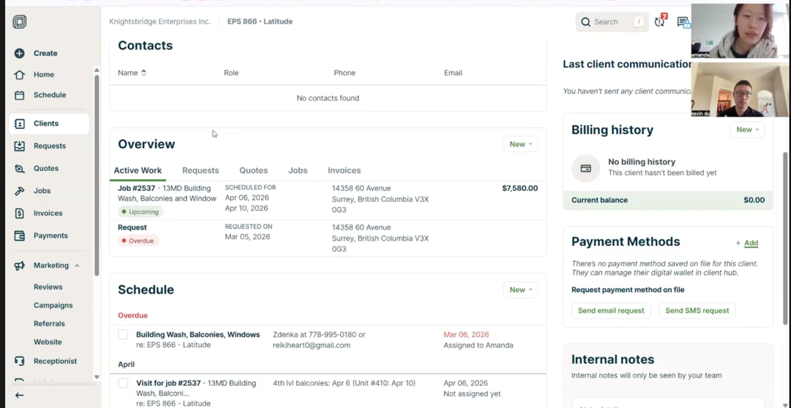

1> 这些是 创建新的 clients 的页面

2> 是 clients list

3> 是 clients 细节展示

site contact 变成一个section，里面可以输入 site contact name, site contact email, site contact phone number, etc.....

website 选项的下面 加一个 description  应该是 rich text 支持多行的输入（为了输入很多信息，比如 大楼的各项数据，年代，材料，等）

在clients list 页面，来说好好的重新设计，需要加些filter 等。。。。

