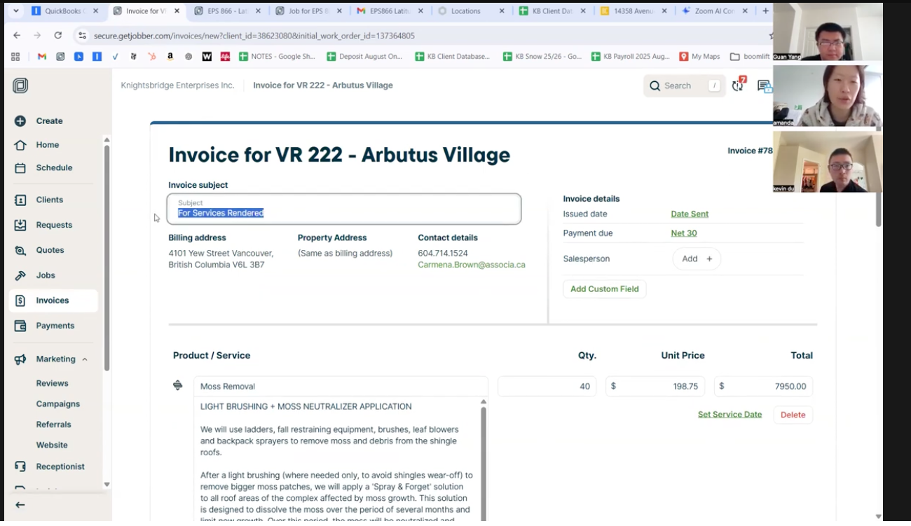
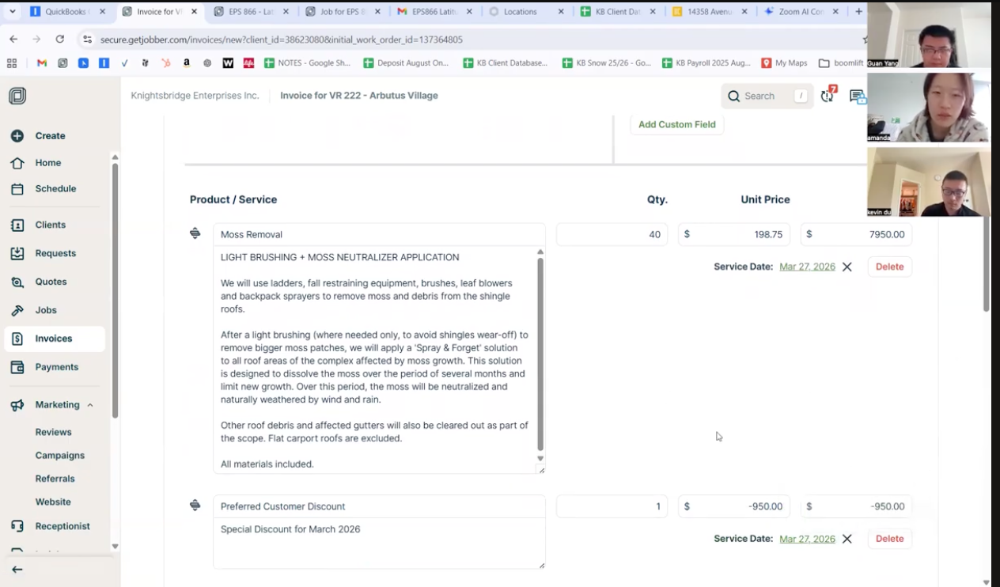
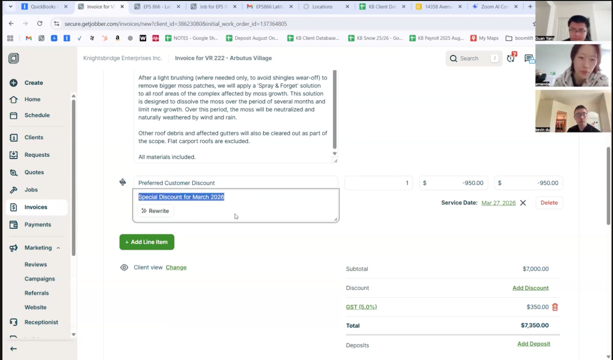
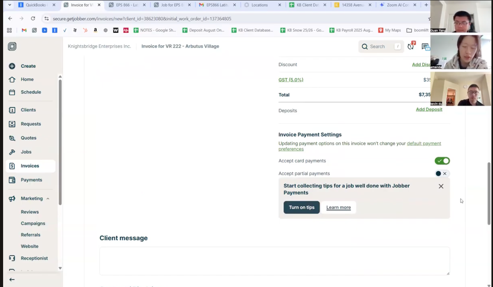
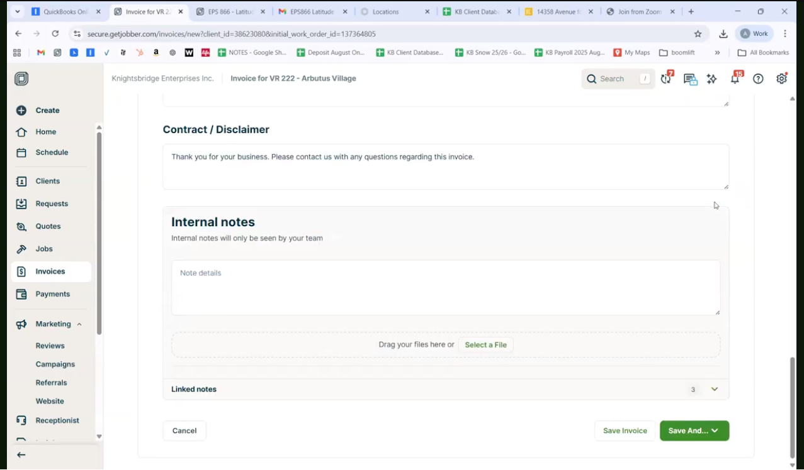
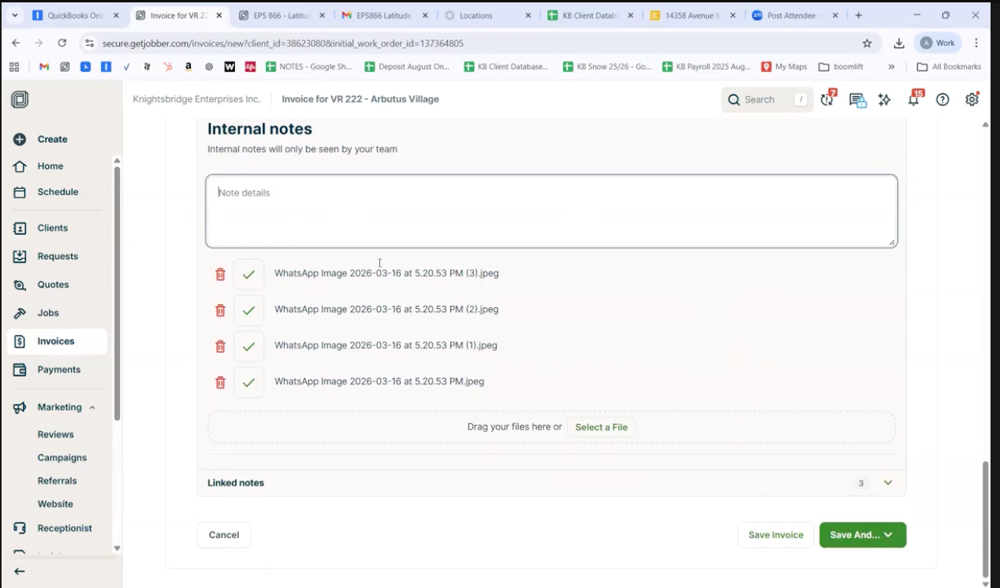
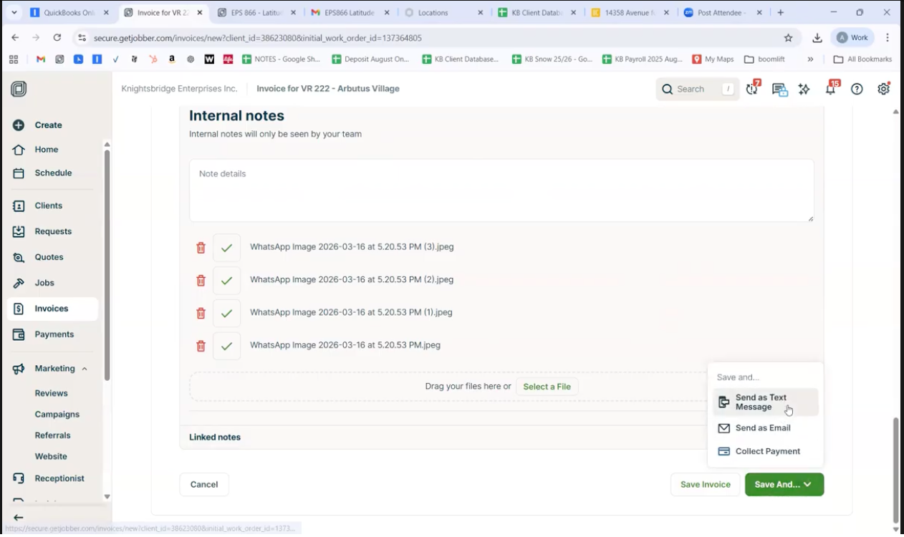
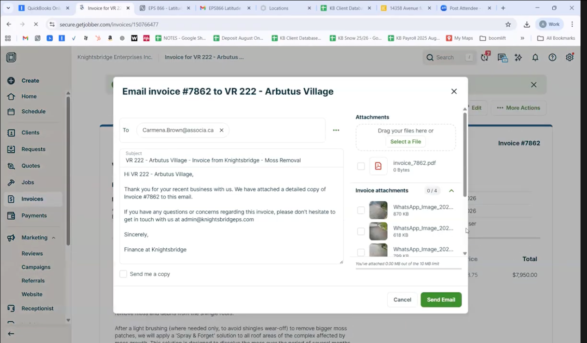
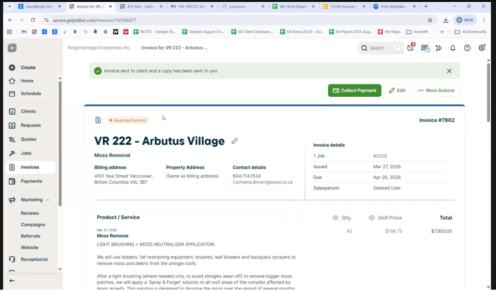

如果是close job 的话，就会到下一步 summary，这个job 的status 就会变成 require invoice，并且可以创建 invoice

1> 点击create invoice 之后

2> 点击send email 之后，我们会到send email page。要输入 email 地址，然后发送

3> send email 之后，invoice 状态会变成 awaiting payment

4> 收到钱之后，可以mark invoice done
