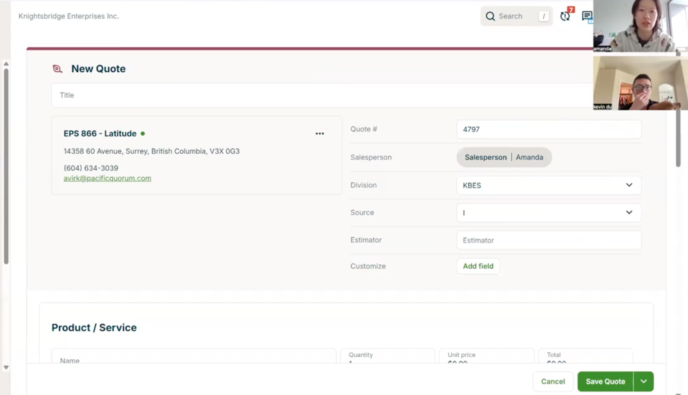
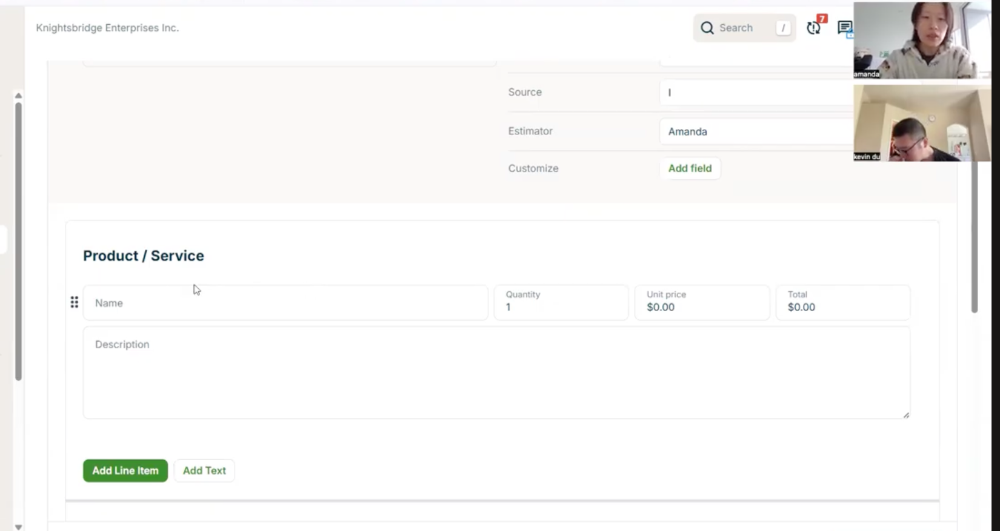
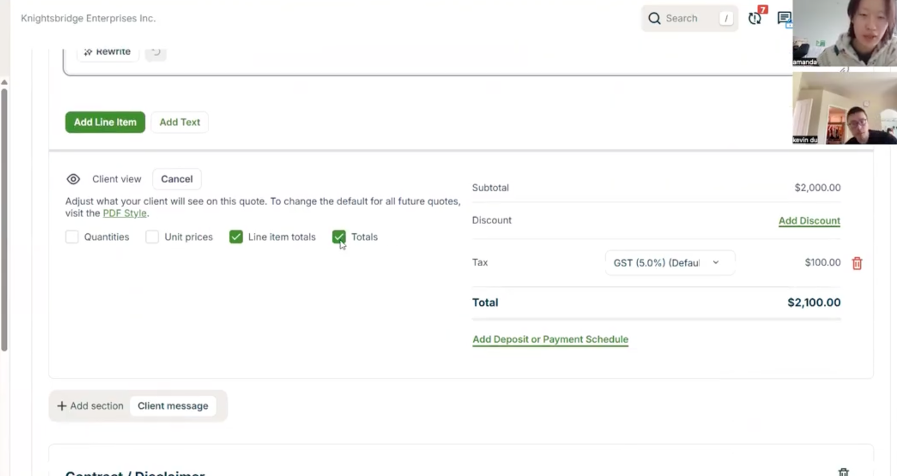
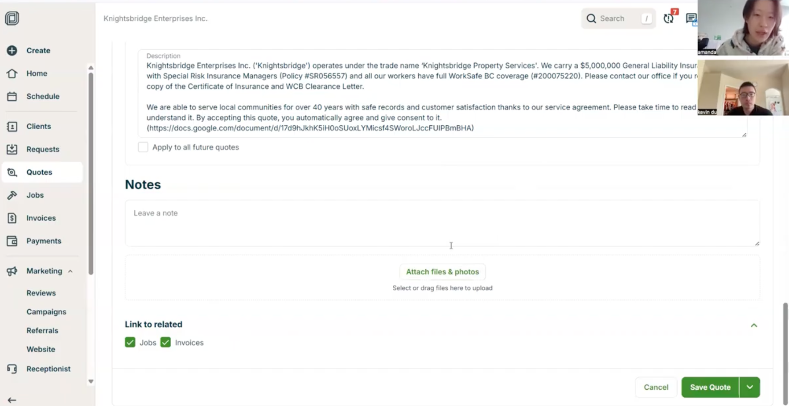
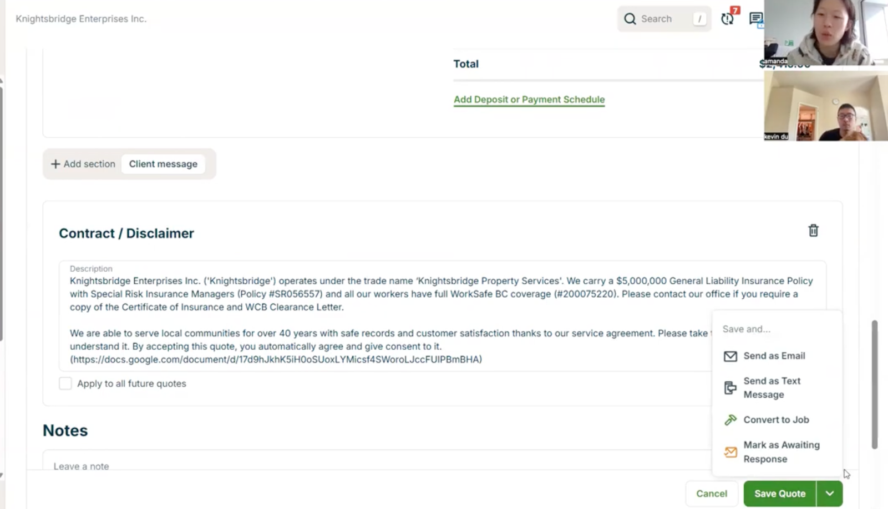
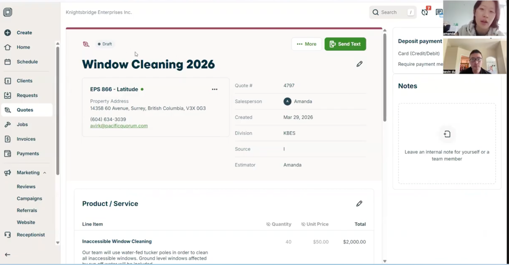
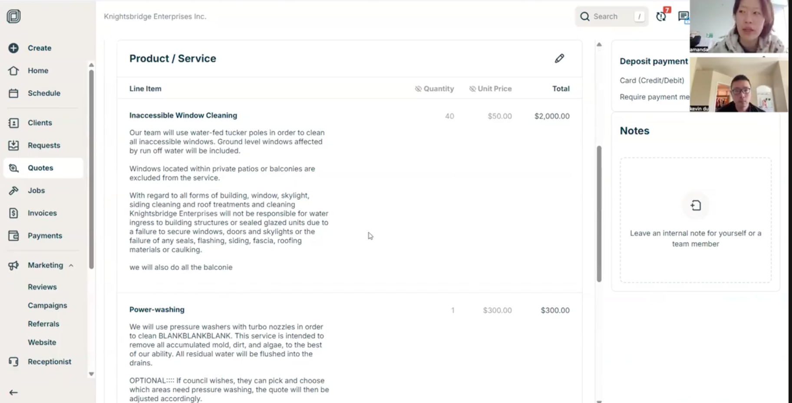
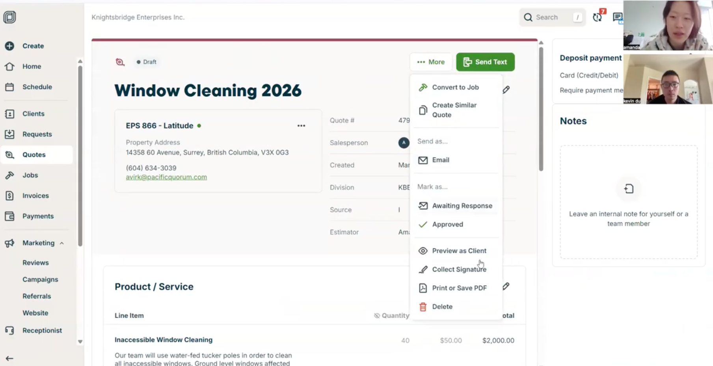

1> 这是 创建新的 quote

2> 如果 steps/quote/img_4.png，直接点击 创建  则是 创建 quote draft 模式

quote 需要有一个 history, 可以显示多个版本的 history（如果之前的客户不满意的话，我们改变了该quote，需要记录改变内容，和原因）

3> 一切都setup 之后，可以  generate quote PDF, collect signature, 设置状态（awaiting response, approve, archive,etc....）

