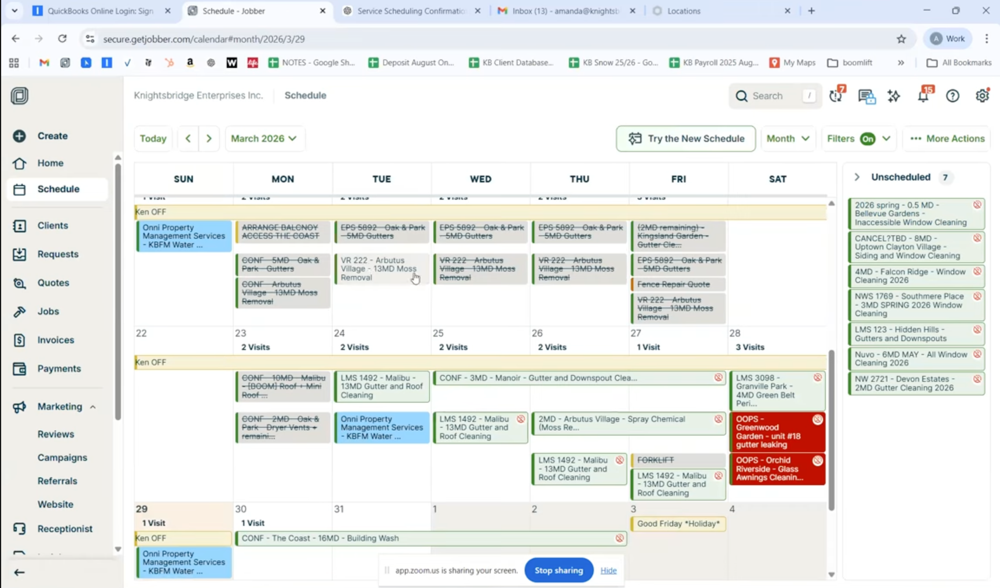
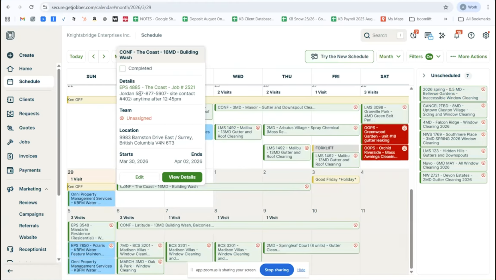
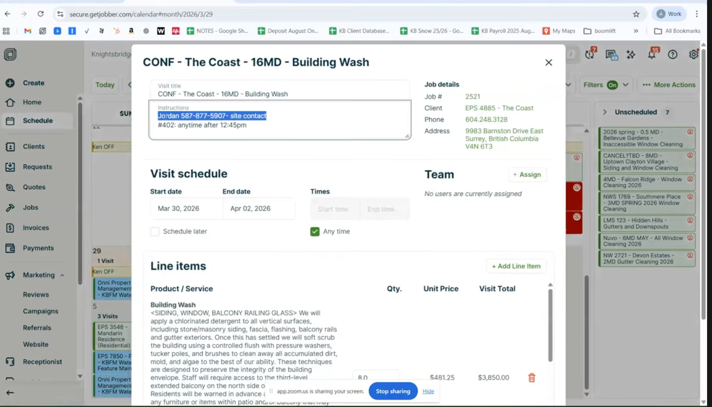
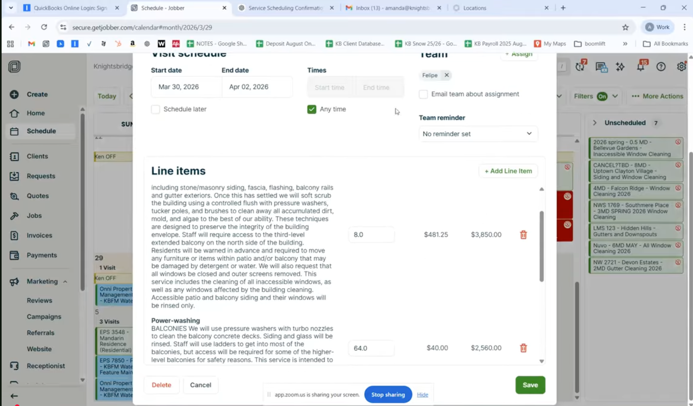
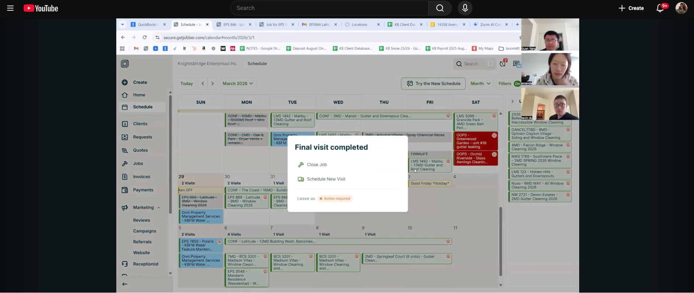
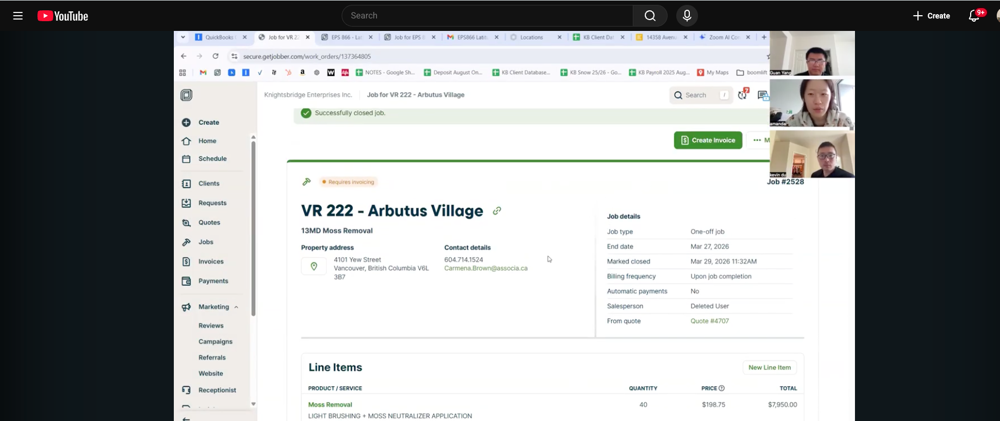
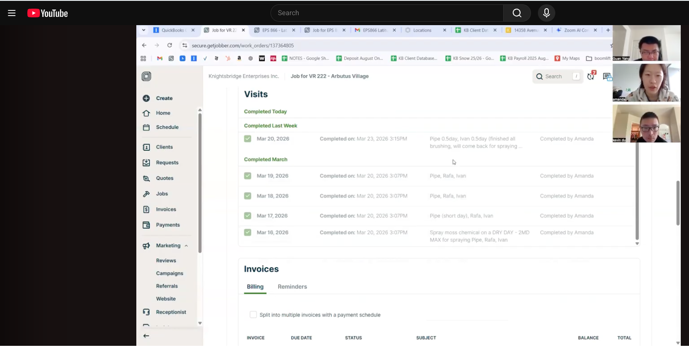

1> schedule 的数据是 job 里的数据  schedule 只是展示

逻辑是 job 必须基于一个 quote
一个 quote 可以生成多个 job 根据 product 来分配
生成之后 就可以在 calendar 里面找到，没有分配日期的就会归到 未分配模块

2> 编辑 schedule

3> 编辑 schedule mark complete 之后。。。。。。
会跳出 final visit 页面，里面有 close job 和 schedule new visit
close 的意思是做完了， schedule new 的意思是没做完，找一天继续做

4> 如果是close job 的话，就会到下一步 summary，这个job 的status 就会变成 require invoice，并且可以创建 invoice

如果检查的没问题，要点击 创建 invoice
